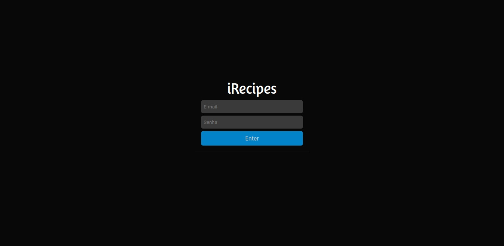
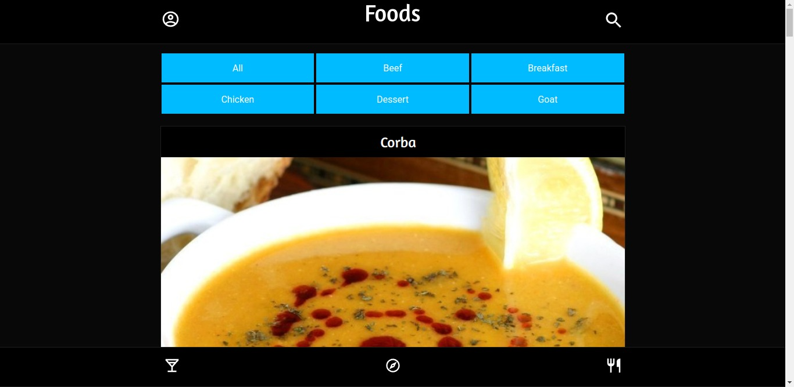
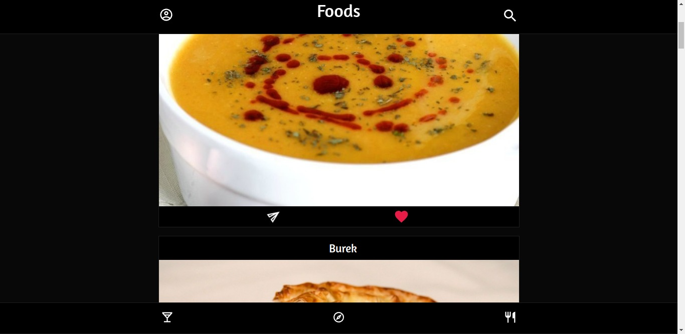
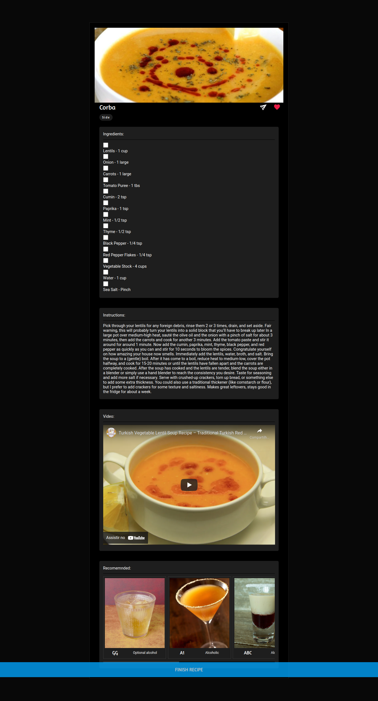
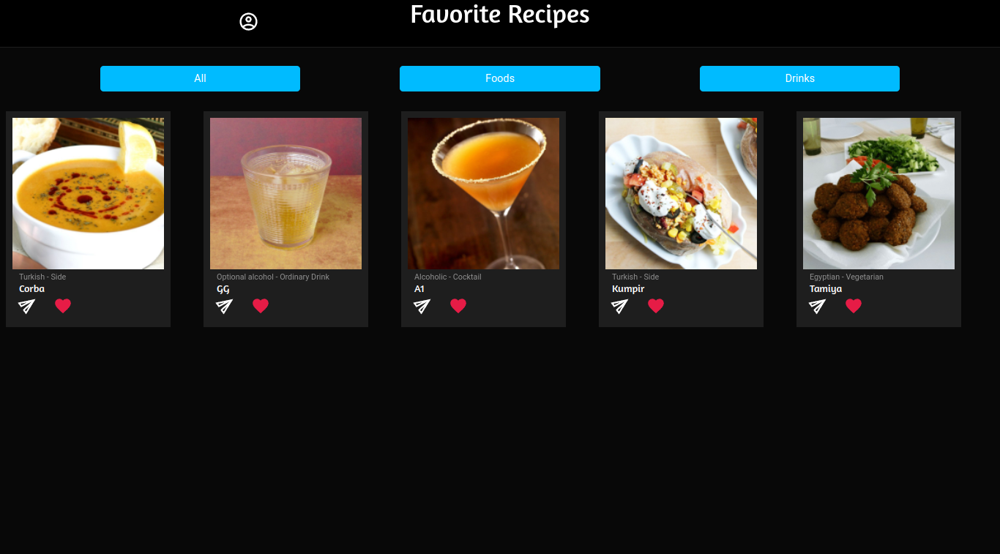

# Recipes App

A ideia desse projeto, é que em grupo, nos deveríamos desenvolver um app de receitas, com foco em mobile first na questão de responsividade, foi utilizado ReactJS, Redux, React Hooks, Context API, para a realização desse projeto.

Nos nos inspiramos no design do Instagram, para podermos criar esse app, e com uma pitada dos produtos da apple.

# Technologies Used

For this project the following technologies were used:

- [JavaScript](https://developer.mozilla.org/pt-BR/docs/Web/JavaScript)
- [ReactJS](https://pt-br.reactjs.org/)
- [Context API](https://pt-br.reactjs.org/docs/context.html)
- [Redux](https://redux.js.org/)
- [Docker](https://www.docker.com/)

 

## Login

 

## Home

 

## Home Favorite and Share Buttons

 

## Recipe Page

 

## Favorites Recipes Page

 

# How to Use:

1. Clone the repository

  ~~~bash
  git clone git@github.com:JeffThierch/Recipes-App.git
  ~~~

2. In the root of the project change the .env_example file to .env

3. (Optional) - Change the environment variables.

4. In the root of project run the commands:

  ~~~bash
  docker-compose up --build
  ~~~

5. If everything is configured correctly, after the build process you can simply access the application.
